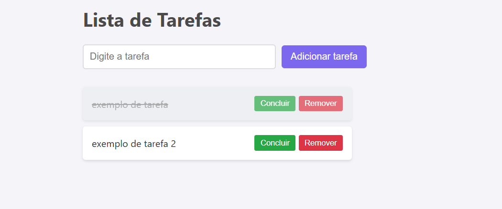

# Projeto Front-End

Um projeto simples e direto feito com HTML, CSS e JavaScript. Ideal para aprendizado, testes ou servir como base para algo maior!

## 📸 Prévia



## 🔧 Tecnologias Utilizadas

- HTML5
- CSS3
- JavaScript (puro)

## 🚀 Como executar

1. Baixe ou clone este repositório:
   ```bash
   git clone https://github.com/valdemar100/Lista-de-tarefas.git
